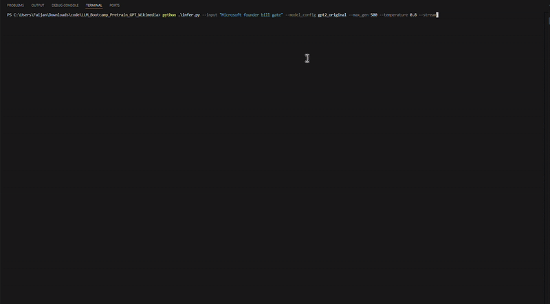
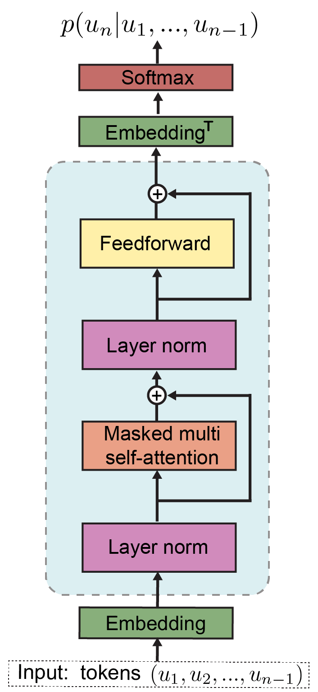

# Training GPT Model on Wikipedia Dataset

This project provides a hands-on learning experience for understanding and implementing a GPT (Generative Pre-trained Transformer) model from scratch. By training on Wikipedia data, you'll learn the fundamentals of transformer architecture, language modeling, and deep learning best practices.


## WikiMedia GPT Model

Below is a demonstration of the GPT model's inference process:




## Learning Objectives

By completing this project, you will:
- Understand the core concepts of transformer architecture
- Learn how to implement attention mechanisms
- Master the process of training large language models
- Gain practical experience with PyTorch
- Learn about tokenization and text preprocessing
- Understand model evaluation and inference

## GPT Architecture Overview

The GPT model architecture consists of several key components:

1. **Input Processing**
   - Tokenization using tiktoken
   - Positional encoding
   - Word embeddings

2. **Transformer Blocks**
   - Multi-head self-attention
   - Layer normalization
   - Feed-forward networks
   - Residual connections

3. **Output Layer**
   - Language modeling head
   - Softmax activation



## Prerequisites

Before starting, ensure you have:
- Python 3.7 or higher
- Basic understanding of:
  - Deep learning concepts
  - PyTorch fundamentals
  - Natural Language Processing basics
  - Git version control

## Required Libraries

```bash
conda create -n gpts python=3.12
conda activate gpts
pip install -r requirements.txt
```

Key dependencies:
- PyTorch: Deep learning framework
- Matplotlib: Visualization
- Loguru: Logging
- Tiktoken: Tokenization
- Datasets: Data handling

## Project Structure

```
LLM_Bootcamp_Pretrain_GPT_Wikimedia/
├── gpt_train.py      # Main training script
├── gpt_dataset.py    # Dataset handling
├── transformer.py    # Transformer model implementation
├── infer.py          # Inference script
├── config.py         # Model and training configurations
├── requirements.txt  # Dependencies
└── assets/          # Project resources
```

## Configuration Details

The `config.py` file contains predefined configurations for the model and training process. These configurations allow you to easily switch between different setups for experimentation.

### Model Configurations
The `MODEL_CONFIGS` dictionary defines various model architectures. For example:
- `gpt2_original`: Mimics the GPT-2 small model with 124M parameters.
  ```python
  "gpt2_original": {
      "vocab_size": 50257,
      "context_length": 1024,
      "emb_dim": 768,
      "n_heads": 12,
      "n_layers": 12,
      "drop_rate": 0.1,
      "qkv_bias": True,
  }
  ```

### Training Settings
The `TRAINING_SETTINGS` dictionary provides different training setups. For example:
- `Foundation better_quality`: Optimized for better generalization with a lower learning rate and more epochs.
  ```python
  "Foundation better_quality": {
      "learning_rate": 2e-4,
      "num_epochs": 50,
      "batch_size": 4,
      "weight_decay": 0.01,
      "warmup_steps": 2000,
      "gradient_accumulation_steps": 8,
      "max_grad_norm": 1.0,
  }
  ```

### Folder Configuration
- `DATAFOLDER`: Directory for storing datasets.
- `MODEL_DIR`: Directory for saving trained models.

## Getting Started

1. **Hugging Face Authentication**
   Create a `.env` file in the project root and add your Hugging Face token:
   ```bash
   # Create .env file
   echo "HF_TOKEN=your_hugging_face_token_here" > .env
   ```
   
   To get your Hugging Face token:
   - Sign up or login at [Hugging Face](https://huggingface.co/)
   - Go to Settings → Access Tokens
   - Create a new token with read access
   - Copy the token and paste it in your .env file

2. **Dataset Preparation**
   ```bash
   python gpt_dataset.py
   ```
   This script downloads and preprocesses the Wikipedia dataset.

3. **Model Configuration**
   The model can be configured through parameters in `gpt_train.py`:
   - Model size (number of parameters)
   - Number of layers
   - Attention heads
   - Learning rate
   - Batch size

4. **Training Process**
   ```bash
   python gpt_train.py
   ```
   The training process includes:
   - Data loading and preprocessing
   - Model initialization
   - Training loop with validation
   - Loss tracking and visualization
   - Model checkpointing

5. **Inference**
   Use the `infer.py` script to generate text from a trained model.

   ### Steps for Inference:
   - Ensure the trained model is saved in the `models/` directory.
   - Run the following command:
     ```bash
     python infer.py --input "Your input text here" --model_config gpt2_original --max_gen 50 --temperature 1.0
     ```
     - `--input`: The input text prompt.
     - `--model_config`: The model configuration key from `config.py`.
     - `--max_gen`: Number of tokens to generate.
     - `--temperature`: Sampling temperature for text generation.
     - `--stream`: Add this flag to stream output tokens in real-time.

   Example:
   ```bash
   python infer.py --input "Once upon a time" --model_config gpt2_original --max_gen 100 --temperature 0.8
   ```

   The generated text will be displayed in the terminal.

6. Export Model to Hugging Face

```bash
python export_to_hf.py
```

This script saves and pushes the trained model, config, tokenizer config, and code to the Hugging Face Hub.

---

###  Run Inference from Hugging Face

```bash
python hf_infer.py
```

This script:
- Downloads the model from Hugging Face
- Loads the custom architecture from `modeling_gpt2_custom.py`
- Runs text generation using your prompt


## Training Details

### Hyperparameters
- Learning rate: Adjustable based on model size
- Batch size: Optimized for available GPU memory
- Number of epochs: Based on dataset size
- Warmup steps: For stable training
- Gradient clipping: To prevent exploding gradients

### Monitoring
- Training loss
- Validation loss
- Learning rate schedule
- Memory usage
- Training speed (tokens/second)

## Resources for Further Learning

- [Attention Is All You Need](https://arxiv.org/abs/1706.03762)
- [GPT-2 Paper](https://cdn.openai.com/better-language-models/language_models_are_unsupervised_multitask_learners.pdf)
- [PyTorch Documentation](https://pytorch.org/docs/stable/index.html)
- [Hugging Face Transformers](https://huggingface.co/docs/transformers/index)
